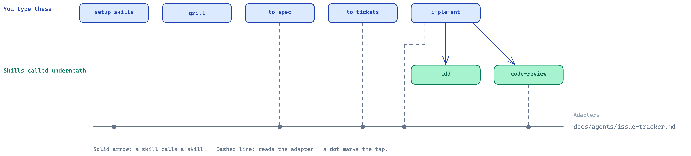

# Design

Source: [`diagrams/what-calls-what.excalidraw`](diagrams/what-calls-what.excalidraw)

## Skills called underneath

You normally do not invoke these directly; the commands in the
[README quick start](README.md#quick-start) use them as needed.

| Skill                                                | Called by                                                                            | Purpose                                                                                                       |
| ---------------------------------------------------- | ------------------------------------------------------------------------------------ | ------------------------------------------------------------------------------------------------------------- |
| [`grilling`](skills/grilling/SKILL.md)               | [`/grill`](skills/grill/SKILL.md), [`/grill-to-docs`](skills/grill-to-docs/SKILL.md) | Questions decisions in rounds until no important assumptions remain                                           |
| [`domain-modeling`](skills/domain-modeling/SKILL.md) | [`/grill-to-docs`](skills/grill-to-docs/SKILL.md)                                    | Clarifies domain terms and records them in `CONTEXT.md`; records important trade-offs in `docs/adr/NNNN-*.md` |
| [`tdd`](skills/tdd/SKILL.md)                         | [`/implement`](skills/implement/SKILL.md)                                            | Runs the red → green loop and keeps tests focused on stable public seams                                      |
| [`code-review`](skills/code-review/SKILL.md)         | [`/implement`](skills/implement/SKILL.md)                                            | Reviews the change separately against repo standards and the ticket/spec                                      |

## Principles

- **Progressive disclosure.** Keep detail in separate files behind pointers.
- **Scaffold lazily.** Create `CONTEXT.md`, `docs/adr/`, and `issues/` only when real work needs them.
- **`issue-tracker.md` is the translation layer.** The skills only name operations — _publish a ticket_, _next unblocked ticket_, _mark done_. This file defines how those operations work in this repo, whether via local `issues/`, GitHub, GitLab, Jira, or another tracker.
- **`domain.md` defines domain knowledge.** It points to the glossary and ADRs, says to use their vocabulary, flag ADR contradictions, and continue silently if they do not exist.

## Caveats

**The order in the [README quick start](README.md#quick-start) is the happy path, not a rule.** What each command actually
requires:

| You can                                                                | Because                                                                                                    |
| ---------------------------------------------------------------------- | ---------------------------------------------------------------------------------------------------------- |
| skip [`/grill`](skills/grill/SKILL.md)                                 | [`/to-spec`](skills/to-spec/SKILL.md) synthesises the conversation; it never interviews you                |
| skip [`/to-spec`](skills/to-spec/SKILL.md)                             | [`/to-tickets`](skills/to-tickets/SKILL.md) reads the conversation and proposes the slug itself            |
| run [`/code-review`](skills/code-review/SKILL.md) any time             | it needs a fixed point, not a ticket — if no ticket, standards review only                                 |
| type the four skills underneath                                        | they are ordinary commands as well                                                                         |
| re-run [`/to-tickets`](skills/to-tickets/SKILL.md) on the same feature | it publishes alongside the tickets already there                                                           |
| [`/implement`](skills/implement/SKILL.md) with no tickets              | a ticket, a spec, and the settled conversation are all valid sources; with no ticket it marks nothing done |

| You cannot                                           | Because                                                     |
| ---------------------------------------------------- | ----------------------------------------------------------- |
| skip [`/setup-skills`](skills/setup-skills/SKILL.md) | four skills stop and tell you to run it                     |
| renumber tickets freely                              | the numbering _is_ the dependency graph — blockers go first |

Other things worth knowing:

- **[`setup-skills`](skills/setup-skills/SKILL.md) appends a `## Language` block to `AGENTS.md`,** and nothing
  else — that file is always in context, so no skill needs a pointer to it. Everything else the skills read is
  `docs/agents/*.md`, by path.
- **Re-running [`setup-skills`](skills/setup-skills/SKILL.md) replaces both adapters** with the seed versions.
  An existing `## Language` block is left alone.
- **[`implement`](skills/implement/SKILL.md) commits.** Default to current branch. Branch first if that matters.
- **One ticket per fresh context window.** Tickets are sized for that.

## Making it yours

- **Different issue tracker** → rewrite `docs/agents/issue-tracker.md`.
- **Different test conventions** → [`tdd/tests.md`](skills/tdd/tests.md) and [`tdd/mocking.md`](skills/tdd/mocking.md) are
  examples, not rules. Replace them with your language's.
- **Different review standards** → drop a `CODING_STANDARDS.md` or
  `CONTRIBUTING.md` in your repo. [`code-review`](skills/code-review/SKILL.md) finds it and lets it override the
  built-in smell baseline. There is nothing to configure.
- **Adding a skill** → if another skill needs to call it, leave
  `disable-model-invocation` off. If only you start it, set it to `true` and pay
  no context.
