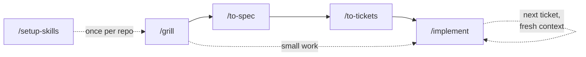

# skills

A small set of agent skills for taking a rough idea to reviewed, committed
code: sharpen it, spec it, slice it into tickets, build them test-first, review
the result.

Derived from [mattpocock/skills](https://github.com/mattpocock/skills) (MIT).

## Install

```bash
npx skills add loijilai/skills
```

**Select the "Loijilai Skills" group.** Its seven skills call each other, and a
missing one fails quietly.
Pick other up only if you want them.

Re-run the same command to update.

## Quick start

These are the commands you type.



| Command                                         | When                                                        | What it writes                                                                                                                      |
| ----------------------------------------------- | ----------------------------------------------------------- | ----------------------------------------------------------------------------------------------------------------------------------- |
| [`/setup-skills`](skills/setup-skills/SKILL.md) | once per repo, before anything else                         | `docs/agents/issue-tracker.md`, a `## Language` block in `AGENTS.md`, a `CLAUDE.md` that imports it, and `CODING_CONVENTION.md`; commits only if you say so |
| [`/grill`](skills/grill/SKILL.md)               | stress-test a plan or design                                | -                                                                                                                                   |
| [`/to-spec`](skills/to-spec/SKILL.md)           | after /grill                                                | `issues/<feature>/spec.md`                                                                                                          |
| [`/to-tickets`](skills/to-tickets/SKILL.md)     | after /to-spec                                              | `issues/<feature>/NN-<slug>.md`                                                                                                     |
| [`/implement`](skills/implement/SKILL.md)       | after /to-tickets, or on a spec or the settled conversation | source, tests, completed criteria, `Status: done`, a commit                                                                         |

## Outside the pipeline

Standalone commands. Use any time, independent of the flow above and of each
other.

| Command                                           | When                                                                                                                                                      |
| ------------------------------------------------- | --------------------------------------------------------------------------------------------------------------------------------------------------------- |
| [`/mentor`](skills/mentor/SKILL.md)               | Socratic mentoring while you build something yourself — a PR, commit, spec, ticket, or the conversation                                                   |
| [`/trace-code`](skills/trace-code/SKILL.md)       | learning how to trace a change and test it by hand until you understand how the code behaves                                                              |
| [`/explain`](skills/explain/SKILL.md)             | learning a concept from scratch — big picture, then intuition, then detail, until you can explain it in an interview                                      |
| [`/to-article`](skills/to-article/SKILL.md)       | a discussion session or a rough draft ready to become a readable article                                                                                  |
| [`/wait-what`](skills/wait-what/SKILL.md)         | lost the thread of what the agent is doing — a short, plain-language re-pitch of the context and where it got to                                          |
| [`/think-clearly`](skills/think-clearly/SKILL.md) | planning a career in the conversation and the thinking has gone crooked — an audit of what you asserted, the errors in it, and one move to make this week |

## Design

See [DESIGN.md](DESIGN.md) for the dependency diagram, the skills called
underneath, the principles behind them, and the caveats worth knowing.

## License

MIT. See [LICENSE](LICENSE) — it carries the original copyright from
[mattpocock/skills](https://github.com/mattpocock/skills), from which much of
this text is taken verbatim.
