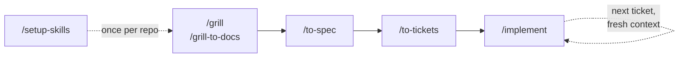

# skills

A small set of agent skills for taking a rough idea to reviewed, committed
code: sharpen it, spec it, slice it into tickets, build them test-first, review
the result.

Derived from [mattpocock/skills](https://github.com/mattpocock/skills) (MIT).

## Install

```bash
npx skills add loijilai/skills
```

**Select all ten.** They call each other, and a missing skill fails quietly.

Re-run the same command to update.

## Quick start

These are the commands you type.



| Command          | When                                | What it writes                                              |
| ---------------- | ----------------------------------- | ----------------------------------------------------------- |
| `/setup-skills`  | once per repo, before anything else | `docs/agents/issue-tracker.md`, `docs/agents/domain.md`     |
| `/grill`         | stateless discussion                | -                                                           |
| `/grill-to-docs` | stateful discussion kept in repo    | `CONTEXT.md`, `docs/adr/NNNN-*.md`, lazily                  |
| `/to-spec`       | after /grill\*                      | `issues/<feature>/spec.md`                                  |
| `/to-tickets`    | after /to-spec                      | `issues/<feature>/NN-<slug>.md`                             |
| `/implement`     | after /to-tickets                   | source, tests, completed criteria, `Status: done`, a commit |

## Design


<sub>Source: [`diagrams/what-calls-what.excalidraw`](diagrams/what-calls-what.excalidraw)</sub>

### Skills called underneath

You normally do not invoke these directly; the commands above use them as needed.

| Skill             | Called by                  | Purpose                                                                                                       |
| ----------------- | -------------------------- | ------------------------------------------------------------------------------------------------------------- |
| `grilling`        | `/grill`, `/grill-to-docs` | Questions decisions in rounds until no important assumptions remain                                           |
| `domain-modeling` | `/grill-to-docs`           | Clarifies domain terms and records them in `CONTEXT.md`; records important trade-offs in `docs/adr/NNNN-*.md` |
| `tdd`             | `/implement`               | Runs the red → green loop and keeps tests focused on stable public seams                                      |
| `code-review`     | `/implement`               | Reviews the change separately against repo standards and the ticket/spec                                      |

### Principles

- **Progressive disclosure.** Keep detail in separate files behind pointers.
- **Scaffold lazily.** Create `CONTEXT.md`, `docs/adr/`, and `issues/` only when real work needs them.
- **`issue-tracker.md` is the translation layer.** The skills only name operations — _publish a ticket_, _next unblocked ticket_, _mark done_. This file defines how those operations work in this repo, whether via local `issues/`, GitHub, GitLab, Jira, or another tracker.
- **`domain.md` defines domain knowledge.** It points to the glossary and ADRs, says to use their vocabulary, flag ADR contradictions, and continue silently if they do not exist.

## Caveats

**The order above is the happy path, not a rule.** What each command actually
requires:

| You can                                  | Because                                                                    |
| ---------------------------------------- | -------------------------------------------------------------------------- |
| skip `/grill`                            | `/to-spec` synthesises the conversation; it never interviews you           |
| skip `/to-spec`                          | `/to-tickets` reads the conversation and proposes the slug itself          |
| run `/code-review` any time              | it needs a fixed point, not a ticket — if no ticket, standards review only |
| type the four skills underneath          | they are ordinary commands as well                                         |
| re-run `/to-tickets` on the same feature | it publishes alongside the tickets already there                           |

| You cannot                   | Because                                                     |
| ---------------------------- | ----------------------------------------------------------- |
| skip `/setup-skills`         | four skills stop and tell you to run it                     |
| `/implement` with no tickets | it implements the conversation, and marks nothing done      |
| renumber tickets freely      | the numbering _is_ the dependency graph — blockers go first |

Other things worth knowing:

- **`setup-skills` does not touch `CLAUDE.md` or `AGENTS.md`.** The skills read
  `docs/agents/*.md` by path.
- **Re-running `setup-skills` replaces both adapters** with the seed versions.
- **`implement` commits.** Default to current branch. Branch first if that matters.
- **One ticket per fresh context window.** Tickets are sized for that.

## Making it yours

- **Different issue tracker** → rewrite `docs/agents/issue-tracker.md`.
- **Different test conventions** → `tdd/tests.md` and `tdd/mocking.md` are
  examples, not rules. Replace them with your language's.
- **Different review standards** → drop a `CODING_STANDARDS.md` or
  `CONTRIBUTING.md` in your repo. `code-review` finds it and lets it override the
  built-in smell baseline. There is nothing to configure.
- **Adding a skill** → if another skill needs to call it, leave
  `disable-model-invocation` off. If only you start it, set it to `true` and pay
  no context.

## License

MIT. See [LICENSE](LICENSE) — it carries the original copyright from
[mattpocock/skills](https://github.com/mattpocock/skills), from which much of
this text is taken verbatim.
