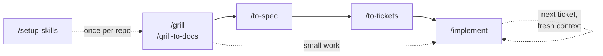

# skills

A small set of agent skills for taking a rough idea to reviewed, committed
code: sharpen it, spec it, slice it into tickets, build them test-first, review
the result.

Derived from [mattpocock/skills](https://github.com/mattpocock/skills) (MIT).

## Install

```bash
npx skills add loijilai/skills
```

**Select all eleven.** They call each other, and a missing skill fails quietly.

Re-run the same command to update.

## Quick start

These are the commands you type.



| Command                                              | When                                | What it writes                                              |
| ---------------------------------------------------- | ----------------------------------- | ----------------------------------------------------------- |
| [`/setup-skills`](skills/setup-skills/SKILL.md)      | once per repo, before anything else | `docs/agents/issue-tracker.md`, `docs/agents/domain.md`, a `## Language` block in `AGENTS.md`; commits only if you say so |
| [`/grill`](skills/grill/SKILL.md)                    | stateless discussion                | -                                                           |
| [`/grill-to-docs`](skills/grill-to-docs/SKILL.md)    | stateful discussion kept in repo    | `CONTEXT.md`, `docs/adr/NNNN-*.md`, lazily                  |
| [`/to-spec`](skills/to-spec/SKILL.md)                | after /grill\*                      | `issues/<feature>/spec.md`                                  |
| [`/to-tickets`](skills/to-tickets/SKILL.md)          | after /to-spec                      | `issues/<feature>/NN-<slug>.md`                             |
| [`/implement`](skills/implement/SKILL.md)            | after /to-tickets, or on a spec or the settled conversation | source, tests, completed criteria, `Status: done`, a commit |
| [`/mentor`](skills/mentor/SKILL.md)                  | any time, on a PR, commit, spec, ticket, or the conversation — outside the pipeline | -                                     |
| [`/debrief`](skills/debrief/SKILL.md)                | any time, on a feature the AI already built and you don't understand — outside the pipeline | -                       |

## Design

See [DESIGN.md](DESIGN.md) for the dependency diagram, the skills called
underneath, the principles behind them, and the caveats worth knowing.

## License

MIT. See [LICENSE](LICENSE) — it carries the original copyright from
[mattpocock/skills](https://github.com/mattpocock/skills), from which much of
this text is taken verbatim.
